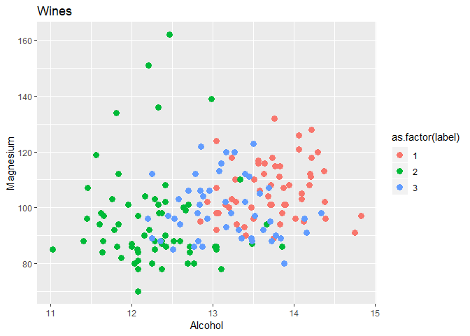
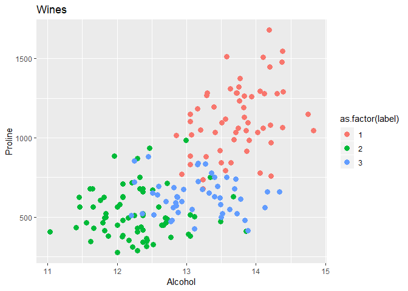
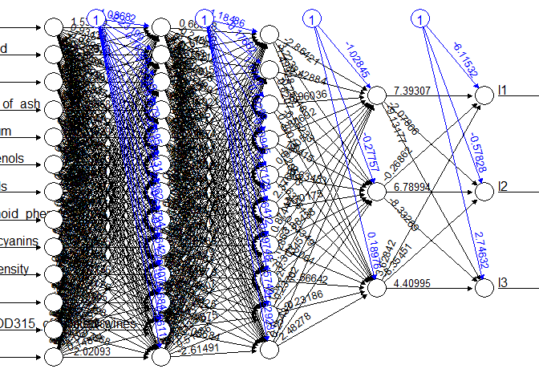

Wines
================

Wines- multilevel classification

Loading libraries

Load data and set names

``` r
wines <- read.csv("data/wines.csv")
names(wines) <- c("label",
                  "Alcohol",
                  "Malic_acid",
                  "Ash",
                  "Alcalinity_of_ash",
                  "Magnesium",
                  "Total_phenols",
                  "Flavanoids",
                  "Nonflavanoid_phenols",
                  "Proanthocyanins",
                  "Color_intensity",
                  "Hue",
                  "OD280_OD315_of_diluted_wines",
                  "Proline")
head(wines)
```

    ##   label Alcohol Malic_acid  Ash Alcalinity_of_ash Magnesium Total_phenols
    ## 1     1   13.20       1.78 2.14              11.2       100          2.65
    ## 2     1   13.16       2.36 2.67              18.6       101          2.80
    ## 3     1   14.37       1.95 2.50              16.8       113          3.85
    ## 4     1   13.24       2.59 2.87              21.0       118          2.80
    ## 5     1   14.20       1.76 2.45              15.2       112          3.27
    ## 6     1   14.39       1.87 2.45              14.6        96          2.50
    ##   Flavanoids Nonflavanoid_phenols Proanthocyanins Color_intensity  Hue
    ## 1       2.76                 0.26            1.28            4.38 1.05
    ## 2       3.24                 0.30            2.81            5.68 1.03
    ## 3       3.49                 0.24            2.18            7.80 0.86
    ## 4       2.69                 0.39            1.82            4.32 1.04
    ## 5       3.39                 0.34            1.97            6.75 1.05
    ## 6       2.52                 0.30            1.98            5.25 1.02
    ##   OD280_OD315_of_diluted_wines Proline
    ## 1                         3.40    1050
    ## 2                         3.17    1185
    ## 3                         3.45    1480
    ## 4                         2.93     735
    ## 5                         2.85    1450
    ## 6                         3.58    1290

``` r
plt1 <- ggplot(wines, aes(x = Alcohol, y = Magnesium, colour = as.factor(label))) +
  geom_point(size=3) +
  ggtitle("Wines")
plt2 <- ggplot(wines, aes(x = Alcohol, y = Proline, colour = as.factor(label))) +
  geom_point(size=3) +
  ggtitle("Wines")
plt1
```



``` r
plt2
```



Train data

``` r
#Encode as a one hot vector multilabel data
train <- cbind(wines[, 2:14], class.ind(as.factor(wines$label))) 
# Generates Class Indicator Matrix from a Factor
# Set labels name
names(train) <- c(names(wines)[2:14],"l1","l2","l3")

# Scale data
scl <- function(x){ (x - min(x))/(max(x) - min(x)) }
train[, 1:13] <- data.frame(lapply(train[, 1:13], scl))
head(train)
```

    ##     Alcohol Malic_acid       Ash Alcalinity_of_ash Magnesium Total_phenols
    ## 1 0.5710526  0.2055336 0.4171123        0.03092784 0.3260870     0.5758621
    ## 2 0.5605263  0.3201581 0.7005348        0.41237113 0.3369565     0.6275862
    ## 3 0.8789474  0.2391304 0.6096257        0.31958763 0.4673913     0.9896552
    ## 4 0.5815789  0.3656126 0.8074866        0.53608247 0.5217391     0.6275862
    ## 5 0.8342105  0.2015810 0.5828877        0.23711340 0.4565217     0.7896552
    ## 6 0.8842105  0.2233202 0.5828877        0.20618557 0.2826087     0.5241379
    ##   Flavanoids Nonflavanoid_phenols Proanthocyanins Color_intensity
    ## 1  0.5105485            0.2452830       0.2744479       0.2645051
    ## 2  0.6118143            0.3207547       0.7570978       0.3754266
    ## 3  0.6645570            0.2075472       0.5583596       0.5563140
    ## 4  0.4957806            0.4905660       0.4447950       0.2593857
    ## 5  0.6434599            0.3962264       0.4921136       0.4667235
    ## 6  0.4599156            0.3207547       0.4952681       0.3387372
    ##         Hue OD280_OD315_of_diluted_wines   Proline l1 l2 l3
    ## 1 0.4634146                    0.7802198 0.5506419  1  0  0
    ## 2 0.4471545                    0.6959707 0.6469330  1  0  0
    ## 3 0.3089431                    0.7985348 0.8573466  1  0  0
    ## 4 0.4552846                    0.6080586 0.3259629  1  0  0
    ## 5 0.4634146                    0.5787546 0.8359486  1  0  0
    ## 6 0.4390244                    0.8461538 0.7218260  1  0  0

Fitting

``` r
f <- l1 + l2 + l3 ~ Alcohol + Malic_acid + Ash + Alcalinity_of_ash + 
    Magnesium + Total_phenols + Flavanoids + Nonflavanoid_phenols + 
    Proanthocyanins + Color_intensity + Hue + OD280_OD315_of_diluted_wines + 
    Proline
nn <- neuralnet(f,
                data = train,
                hidden = c(13,10,3),
                act.fct = "logistic",
                linear.output = FALSE,
                lifesign = "minimal")
```

    ## hidden: 13, 10, 3    thresh: 0.01    rep: 1/1    steps:      84  error: 0.02768  time: 0.2 secs

``` r
summary(nn)
```

    ##                     Length Class      Mode    
    ## call                   7   -none-     call    
    ## response             531   -none-     numeric 
    ## covariate           2301   -none-     numeric 
    ## model.list             2   -none-     list    
    ## err.fct                1   -none-     function
    ## act.fct                1   -none-     function
    ## linear.output          1   -none-     logical 
    ## data                  16   data.frame list    
    ## net.result             1   -none-     list    
    ## weights                1   -none-     list    
    ## startweights           1   -none-     list    
    ## generalized.weights    1   -none-     list    
    ## result.matrix        370   -none-     numeric

``` r
plot(nn)
```



Predictions

``` r
pr.nn <- compute(nn, train[, 1:13])
# Extract results
pr.nn_ <- pr.nn$net.result
head(pr.nn_)
```

    ##              [,1]            [,2]           [,3]
    ## [1,] 0.9904466520 0.0007032794432 0.001675353641
    ## [2,] 0.9900904083 0.0007480833523 0.001644473143
    ## [3,] 0.9913246144 0.0001741952259 0.008614901514
    ## [4,] 0.9810669157 0.0053155508911 0.000382542632
    ## [5,] 0.9912117256 0.0002301926182 0.006154699204
    ## [6,] 0.9911538419 0.0002855883399 0.004717096405

Accuracy

``` r
# Accuracy (training set)
original_values <- max.col(train[, 14:16])
pr.nn_2 <- max.col(pr.nn_)
mean(pr.nn_2 == original_values)
```

    ## [1] 1

Crossvalidate

``` r
set.seed(10)
k <- 10
outs <- NULL
proportion <- 0.995

for(i in 1:k)
{
  index <- sample(1:nrow(train), round(proportion*nrow(train)))
  train_cv <- train[index, ]
  test_cv <- train[-index, ]
  nn_cv <- neuralnet(f,
                     data = train_cv,
                     hidden = c(13, 10, 3),
                     act.fct = "logistic",
                     linear.output = FALSE)
  # Prediction
  pr.nn <- compute(nn_cv, test_cv[, 1:13])
  # Extract results
  pr.nn_ <- pr.nn$net.result
  # Accuracy on testset
  original_values <- max.col(test_cv[, 14:16])
  pr.nn_2 <- max.col(pr.nn_)
  outs[i] <- mean(pr.nn_2 == original_values)
}
```

``` r
# Average accuracy
mean(outs)
```

    ## [1] 1

Ref: <https://www.r-bloggers.com/multilabel-classification-with-neuralnet-package/>
